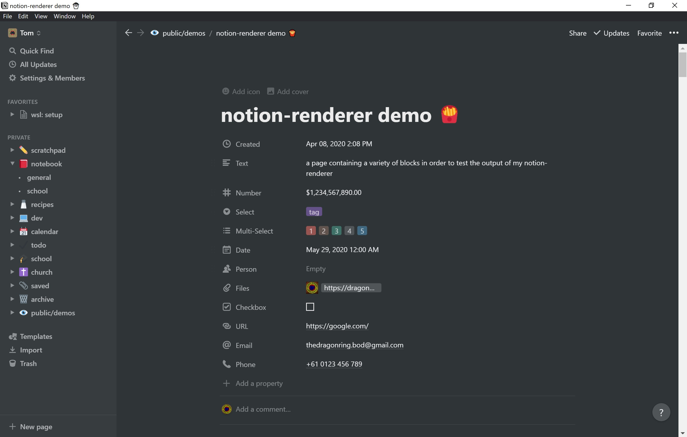
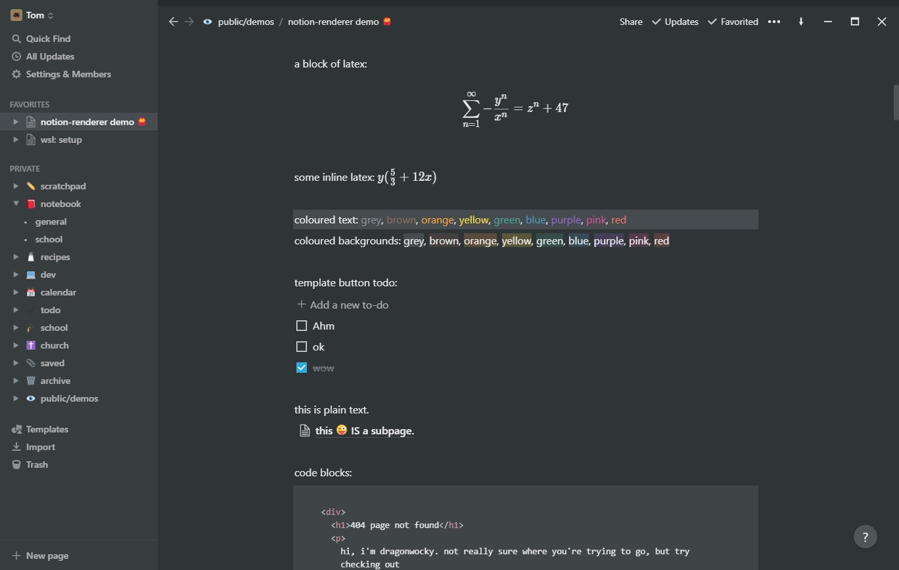
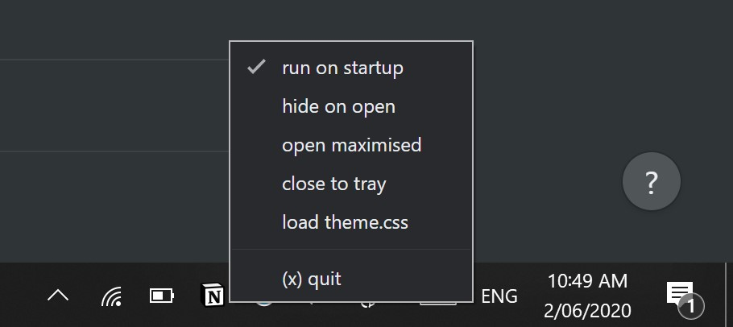

# notion enhancer

an enhancer/customiser for the all-in-one productivity workspace [notion.so](https://www.notion.so/)

## installation

there are a lot of ways to use notion. some official clients, many not.

the enhancer supports:

- the windows/mac versions of the app downloadable from [https://notion.so/desktop](https://notion.so/desktop).
- the arch linux AUR [notion-app](https://aur.archlinux.org/packages/notion-app/) package
- the linux [notion-app](https://github.com/jaredallard/notion-app) installer
- the debian [notion-deb-builder](https://github.com/davidbailey00/notion-deb-builder/tree/229f2868e117e81858618783b83babd00c595000).

there are others, yes. the enhancer does not support them. you should not expect them to work.
if for some reason you need to use one of them instead of the above listed ones, open a
[platform support](https://github.com/dragonwocky/notion-enhancer/issues/new?assignees=&labels=enhancement&template=platform-support.md&title=) request.

please do not modify the enhancer code specifically to work for your installation.
if you have the know-how to do so, instead open a pull request with your changes
so that proper support can be added for all users of that client.

mobile clients are not supported and due to system limitations/restrictions cannot be.

(the [styles](#styling) should also work for the web version.
these can be installed via an extension like [stylus](https://chrome.google.com/webstore/detail/stylus/clngdbkpkpeebahjckkjfobafhncgmne?hl=en)
or a built-in feature like [userChrome.css](https://www.userchrome.org/).)

if the script is run from the WSL, it will enhance the windows version of the app.

1. install node.js: [windows/macOS](https://nodejs.org/en/download/), [linux/WSL](https://github.com/mklement0/n-install).
2. install python: [windows/macOS](https://www.python.org/downloads/), [linux/WSL](https://docs.python-guide.org/starting/install3/linux/).
3. reboot.
4. in the appropriate terminal/command line, run `npm install -g asar` (check installation by running `asar`).
5. [download this enhancer](https://github.com/dragonwocky/notion-enhancer/archive/master.zip) & extract
   to a location it can safely remain (if running the script from the WSL, make sure this is from a location within the windows filesystem).
6. ensure no notion processes are running - you may want to check the task manager to make sure.
7. optional: to remove previous applications of the notion enhancer, run `cleaner.py`.
8. optional: modify the `resources/user.css` file to your liking (see [styling](#styling)).
9. run `customiser.py` to build changes. (for linux run with sudo)

done: run notion and enjoy.

## faq

**now the notion app won't open :(**

1. kill any notion tasks in the task manager (`ctrl+shift+esc`).
2. run `cleaner.py`.
3. reboot.
4. follow instructions above (ensuring notion _isn't_ running! again, check task manager).

**i tried opening the python file but it just closed instantly and nothing happened?**

python scripts must be run from the terminal or command prompt via e.g. `python customiser.py`.

**now that I've run the script, can I delete the enhancer folder?**

no! user style files `resources/user.css` and `resources/theme.css` are fetched from here each time you open notion.
additionally, if you ever need to change or reset your notion build, the `customiser.py` and `cleaner.py` files will be useful.

unless you're sure you know what you're doing (if you have to ask, you probably don't) then do not delete anything.

**something isn't working, and the suggestions here haven't fixed it...**

this is probably a bug. please submit a
[bug report](https://github.com/dragonwocky/notion-enhancer/issues/new?assignees=&labels=bug&template=bug-report.md&title=).

**can the enhancer do \_\_\_?**

experienced problems with the notion app, or just want to add something a bit more to it? please submit a
[feature request](https://github.com/dragonwocky/notion-enhancer/issues/new?assignees=&labels=enhancement&template=feature-request.md&title=).

## features

### titlebar

default windows titlebar/frame has been replaced by one more fitting to the theme of the app.

this includes the addition of an extra button, "always on top"
symbolised with an arrow. when toggled to point up,
notion will remain the top visible window even if not focused.

### nicer scrollbars

i mean, yeah. get rid of those ugly default scrollbars and use nice inconspicuous
ones that actually look as if they're part of notion.

to add these to the web version, copy lines 74 - 105 from `user.css` into your css customiser.

_image: before enhancement_

_image: after default enhancement_

### hotkeys

- **reload window**: in addition to the built-in `CmdOrCtrl+R` reload,
  you can now reload a window with `F5`.
- **toggle all notion windows to/from the tray**: `CmdOrCtrl+Shift+A` by default.

to set your own toggle hotkey, open `customiser.py` and change line 19 (`hotkey = 'CmdOrCtrl+Shift+A'`)
to your preference. you will need to run or re-run `customiser.py` afterwards.

### tray

single-click to toggle app visibility. right click to open menu.

- **run on startup**: run notion on boot/startup. (default: true)
- **hide on open**: hide the launch of notion to the tray. (default: false)
- **open maximised**: maximize the app on open. (default: false)
- **close to tray**: close window to tray rather than closing outright
  on click of `⨉`. does not apply if multiple notion windows are open. (default: false)
- **load theme.css**: loads the custom colour theme file.
  see [colour theming](STYLING.md#colour-theming) for more information. (default: false)

_image: open application tray_

## styling

custom appearances can be applied to the app via the `resources/user.css` and `resources/theme.css` files. for more information,
and a list of various optional styling changes, see [the page on styling](STYLING.md).

## other details

credit where credit is due, this was originally made by Uzver (github: [@TarasokUA](https://github.com/TarasokUA),
telegram: [UserFromUkraine](https://t.me/UserFromUkraine), discord: Uzver#8760).
he has approved my go-ahead with this fork, as he himself no longer wishes to continue development on the project.

the notion logo belongs entirely to the notion team, and was sourced from their
[media kit](https://www.notion.so/Media-Kit-205535b1d9c4440497a3d7a2ac096286).

if you have any questions, check [my website](https://dragonwocky.me/) for contact details.
