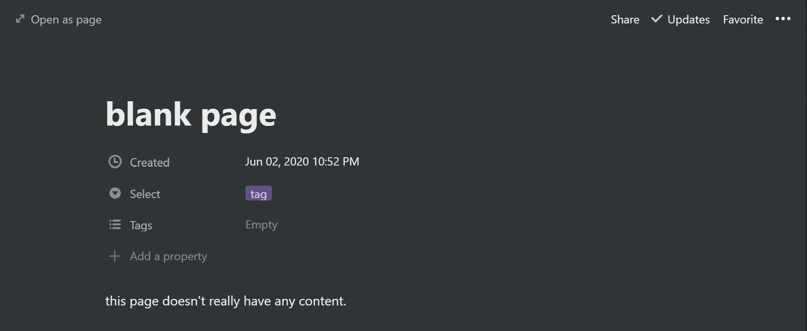
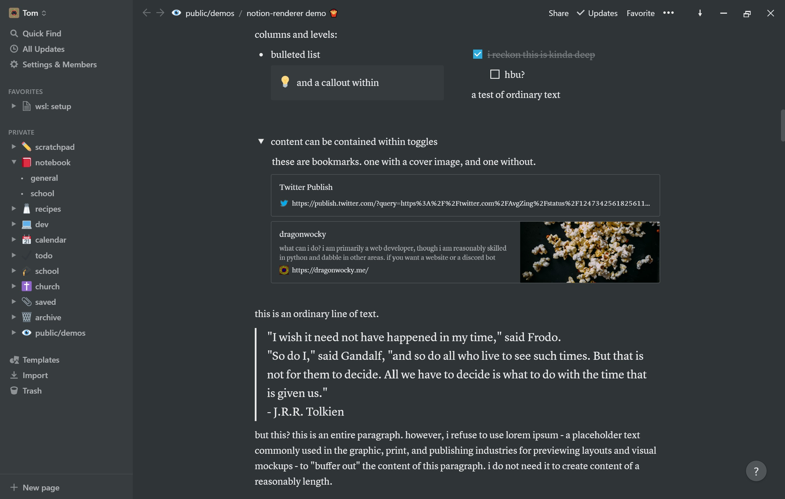
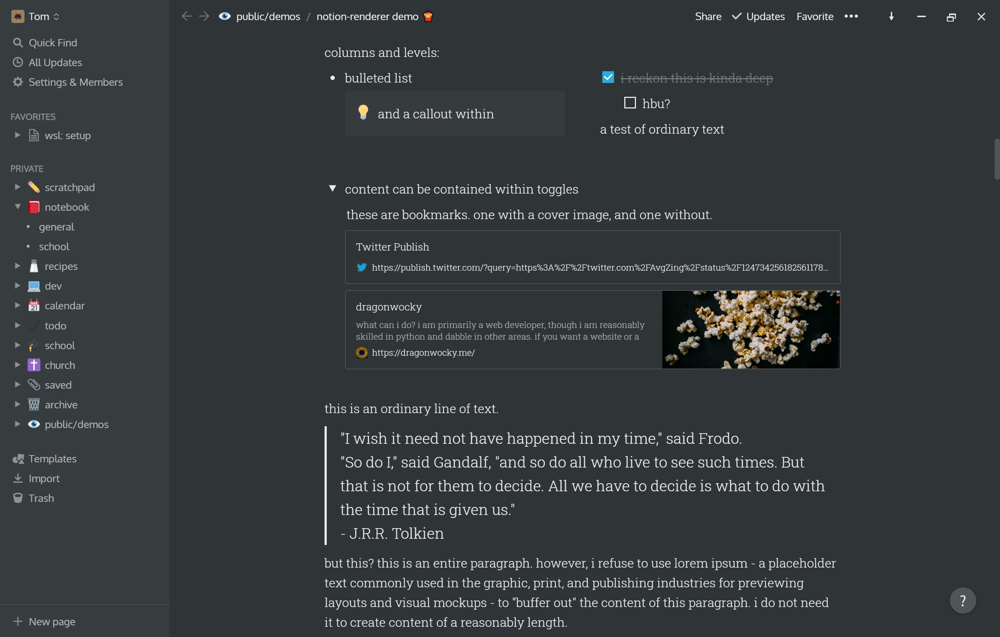
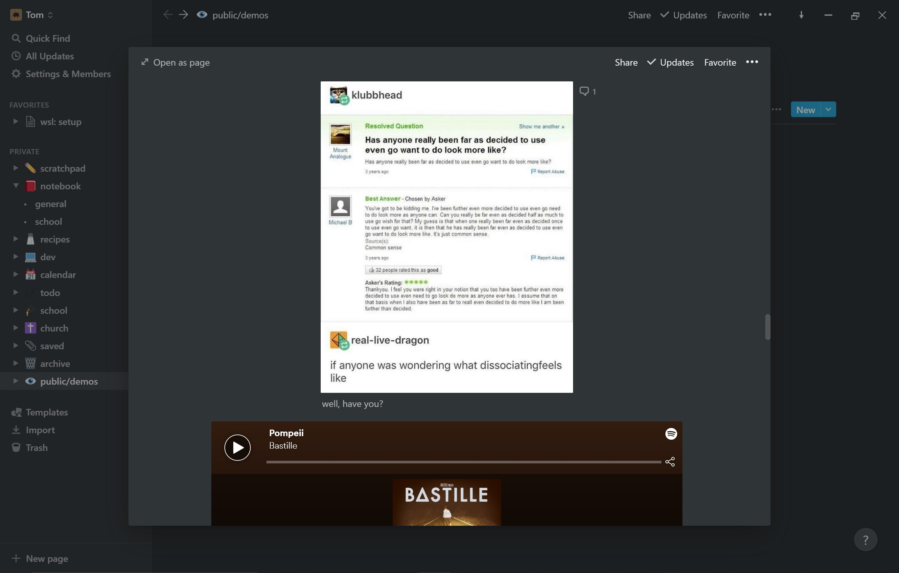
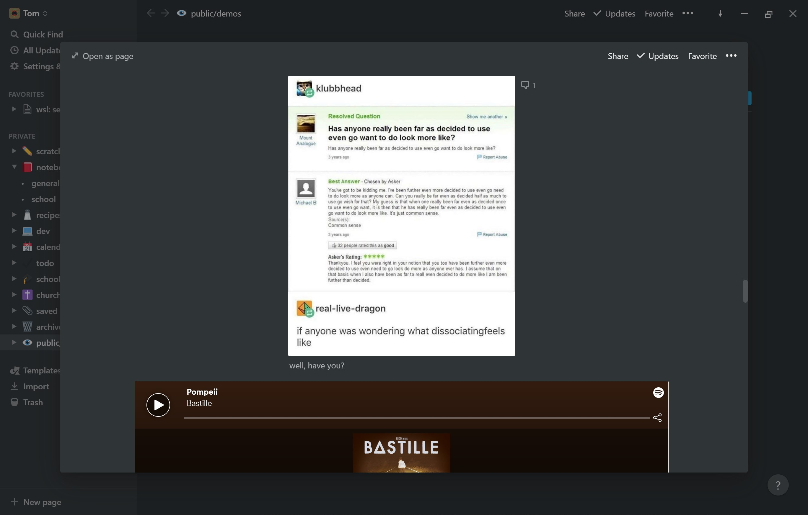

# styling

to modify the appearance of the notion app, edit the style rules in `resources/user.css`,
use some of the suggested/documented optional styles below, or invent your own.

these styles are written in a language called "CSS". if you don't know what this is and are interested,
check out some youtube videos or [try a free short course like the one on codecademy](https://www.codecademy.com/learn/learn-css).

due to the enhancements directly fetching from the local CSS files,
changes will be applied instantly on notion reload
(no need to re-run `customiser.py` every time you want to change some styles).

these should also work for the web version, if copied into your css customiser.

css below will work for every instance of the element, but if you wish to hide only a specific element
(e.g. the '+ new' table row) it is recommended that you prepend each selector with
`[data-block-id='ID']` ([video tutorial on fetching IDs](https://www.youtube.com/watch?v=6V7eqShm_4w)).

### colour theming

this replaces the default notion dark theme. the provided theme file is my custom dark+ theme:
if you have another you wish to share, please contact me. if a few themes are submitted i will
set up a distribution method (either including them as optionally-enableabled themes or sharing them on the website).

to enable, see the [tray](README.md#tray) options.

to modify, enter the `theme.css` file and change the colour values within the `:root {}` - value names
should describe what each colour will affect.


_image: the dark+ theme_

### hide discussions (comment threads at the top of each page)

```css
.notion-page-view-discussion {
  display: none !important;
}
```


_image: before_


_image: after_

### custom fonts

**the `@import` statement must be added to the top of the file (with nothing above it**
**except comments or other `@import` statements)**

to change the fonts, change the font-family property. there are
plenty of other fonts that can be found on google fonts or that may be on your system already.

```css
@import url('https://fonts.googleapis.com/css2?family=Fira+Code&family=Oxygen&family=Roboto+Slab:wght@300&display=swap');
.notion-app-inner {
  font-family: 'Oxygen', sans-serif !important;
}
[style*='monospace;'] {
  font-family: 'Fira Code', monospace !important;
}
[style*=', serif;'] {
  font-family: 'Roboto Slab', serif !important;
}
```


_image: before_


_image: after_

### font resizing

**not recommended:** this can mess up container sizes.
it is suggested to instead use `ctrl+` or `ctrl-` to scale everything up/down.

to change the size, change the value of `--font-scale`.

```css
:root {
  --font-scale: 1.4;
}
.notion-app-inner {
  font-size: calc(var(--font-scale) * 16px) !important;
}
[style*='font-size: 40px'] {
  font-size: calc(var(--font-scale) * 40px) !important;
}
[style*='font-size: 16px'] {
  font-size: calc(var(--font-scale) * 16px) !important;
}
[style*='font-size: 14px'] {
  font-size: calc(var(--font-scale) * 14px) !important;
}
[style*='font-size: 12px'] {
  font-size: calc(var(--font-scale) * 12px) !important;
}
[style*='font-size: 11px'] {
  font-size: calc(var(--font-scale) * 11px) !important;
}
[style*='font-size: 1.25em'] {
  font-size: calc(var(--font-scale) * 1.25em) !important;
}
```


_image: after_

### wider page preview

```css
.notion-peek-renderer > div:nth-child(2) {
  max-width: 85vw !important;
}
```


_image: before_


_image: after_

### thinner cover image

```css
[style^='position: relative; width: 100%; display: flex; flex-direction: column; align-items: center; height: 30vh;'] {
  height: 12vh !important;
}
[style^='position: relative; width: 100%; display: flex; flex-direction: column; align-items: center; height: 30vh;']
  img {
  height: 12vh !important;
}
```


_image: before_


_image: after_

### table columns below 100px

**not recommended!** this is unreliable and will cause bugs.
coincidentally, this is also what the youtube video linked above shows how to do.
as it is a per-table-column style, unlike all others here, it must be prepended with the block ID.

```css
[data-block-id^='ID']
  > [style^='display: flex; position: absolute; background: rgb(47, 52, 55); z-index: 82; height: 33px; color: rgba(255, 255, 255, 0.6);']
  > div:nth-child(1)
  > div:nth-child(10)
  > div:nth-child(1),
[data-block-id^='ID']
  > [style^='position: relative; min-width: calc(100% - 192px);']
  > [data-block-id]
  > div:nth-child(10),
[data-block-id^='ID'] > div:nth-child(5) > div:nth-child(10) {
  width: 45px !important;
}
[data-block-id^='ID']
  [style^='position: absolute; top: 0px; left: 0px; pointer-events: none;']:not(.notion-presence-container) {
  display: none;
}
```

### hide '+ new' table row

```css
.notion-table-view-add-row {
  display: none !important;
}
```


_image: before_


_image: after_

### hide calculations table row

```css
.notion-table-view-add-row + div {
  display: none !important;
}
```


_image: before_


_image: after_

### hide '+ new' board row

```css
.notion-board-group
  [style='user-select: none; transition: background 120ms ease-in 0s; cursor: pointer; display: inline-flex; align-items: center; flex-shrink: 0; white-space: nowrap; height: 32px; border-radius: 3px; font-size: 14px; line-height: 1.2; min-width: 0px; padding-left: 6px; padding-right: 8px; color: rgba(255, 255, 255, 0.4); width: 100%;'] {
  display: none !important;
}
```

### hide board view hidden columns

```css
.notion-board-view > [data-block-id] > div:nth-last-child(2),
.notion-board-view > [data-block-id] > div:first-child > div:nth-last-child(2) {
  display: none !important;
}
```

### hide board view 'add a group'

```css
.notion-board-view > [data-block-id] > div:last-child,
.notion-board-view > [data-block-id] > div:first-child > div:last-child {
  display: none !important;
}
```

### centre-align table column headers

```css
.notion-table-view-header-cell > div > div {
  margin: 0px auto;
}
```

### smaller table column header icons

```css
[style^='display: flex; position: absolute; background: rgb(47, 52, 55); z-index: 82; height: 33px; color: rgba(255, 255, 255, 0.6);']
  div:nth-child(1)
  svg {
  height: 10px !important;
  width: 10px !important;
  margin-right: -4px;
}
```

### remove icons from table column headers

```css
.notion-table-view-header-cell [style^='margin-right: 6px;'] {
  display: none !important;
}
```

### removing/decreasing side padding for tables

```css
[style^='flex-shrink: 0; flex-grow: 1; width: 100%; max-width: 100%; display: flex; align-items: center; flex-direction: column; font-size: 16px; color: rgba(255, 255, 255, 0.9); padding: 0px 96px 30vh;']
  .notion-table-view,
[class='notion-scroller'] > .notion-table-view {
  padding-left: 35px !important;
  padding-right: 15px !important;
  min-width: 0% !important;
}
[style^='flex-shrink: 0; flex-grow: 1; width: 100%; max-width: 100%; display: flex; align-items: center; flex-direction: column; font-size: 16px; color: rgba(255, 255, 255, 0.9); padding: 0px 96px 30vh;']
  .notion-selectable
  .notion-scroller.horizontal::-webkit-scrollbar-track {
  margin-left: 10px;
  margin-right: 10px;
}
```

### removing/decreasing side padding for boards

```css
.notion-board-view {
  padding-left: 10px !important;
  padding-right: 10px !important;
}
```
